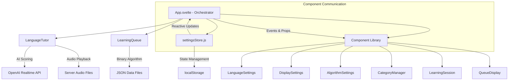

# App.svelte Developer Documentation

## Overview

App.svelte serves as the main orchestrator for a sophisticated language learning application that combines AI-powered pronunciation scoring with adaptive spaced repetition. The application follows a component-based architecture with centralised state management, integrating the **LanguageTutor** (AI interface with server-side audio) and **LearningQueue** (binary pass/fail algorithm) systems to create an effective, personalised learning experience.

## Architecture Overview



## Component Architecture

### Main App Component (App.svelte)
**Role**: System orchestrator and integration layer
- Initialises and coordinates LanguageTutor and LearningQueue systems
- Manages learning session lifecycle
- Handles component communication via events
- Provides centralised logging system

### Settings Store (settingsStore.js)
**Role**: Centralised state management with automatic persistence
- Writable Svelte store with localStorage integration
- Handles all user preferences and application configuration
- Provides reactive updates across the entire application
- Automatic serialisation and deserialisation

### Component Library
**Role**: Focused, reusable UI components
- **LanguageSettings**: Language pair selection and validation
- **DisplaySettings**: UI preferences and timing controls
- **AlgorithmSettings**: Binary algorithm tuning and developer tools
- **CategoryManager**: Learning category selection with validation
- **LearningSession**: Current phrase display and session controls
- **QueueDisplay**: Learning queue visualisation and progress tracking

## State Management Architecture

### Centralised Settings Store

```javascript
// settingsStore.js - Single source of truth for all application state
const defaultSettings = {
  // Language Configuration
  nativeLanguage: 'English',
  learningLanguage: 'Italian',
  
  // Display Options
  showExpectedOutput: 'always', // 'always', 'never', 'struggling'
  showCategory: true,
  showFeedback: true,
  showUpcomingQueue: false,
  
  // Audio & Timing Controls
  translationThreshold: 7,
  pauseBetweenTests: 3,
  pauseWhenStruggling: 5,
  
  // Binary Algorithm Controls
  passThreshold: 7,
  repetitivenessFactor: 5,
  
  // Developer Settings (Easter Egg)
  loggingVerbosity: 5,
  showDeveloperSettings: false,
  
  // Category Preferences
  enabledCategories: {}
};
```

### Reactive State Management

```javascript
// App.svelte - Subscribe to settings store for reactive updates
settings.subscribe(value => {
  currentSettings = value;
  
  // Automatically update systems when critical settings change
  if (isInitialized) {
    updateSystems();
  }
});

// Automatic persistence - no manual localStorage calls needed
settings.updateSetting('nativeLanguage', 'Spanish'); // Auto-saves to localStorage
```

### Store Methods

```javascript
// Load from localStorage on app initialization
settings.load();

// Update single setting with automatic persistence
settings.updateSetting('translationThreshold', 8);

// Update multiple settings atomically
settings.updateSettings({
  passThreshold: 8,
  repetitivenessFactor: 6
});

// Reset to defaults
settings.reset();
```

## Component Communication Patterns

### Parent-to-Child (Props)
```javascript
// App.svelte passes reactive settings to components
<LanguageSettings
  nativeLanguage={currentSettings.nativeLanguage}
  learningLanguage={currentSettings.learningLanguage}
  {languages}
  loggingVerbosity={currentSettings.loggingVerbosity}
  on:languageChange={handleLanguageChange}
/>
```

### Child-to-Parent (Events)
```javascript
// Components dispatch events for state changes
// LanguageSettings.svelte
const dispatch = createEventDispatcher();

function handleLanguageChange(type, newLanguage) {
  dispatch('languageChange', { type, newLanguage });
}

// App.svelte handles the event
function handleLanguageChange(event) {
  const { type, newLanguage } = event.detail;
  
  if (type === 'native' && newLanguage !== currentSettings.learningLanguage) {
    settings.updateSetting('nativeLanguage', newLanguage);
  }
}
```

### Two-Way Binding for Simple Values
```javascript
// Direct binding for settings that don't require complex logic
<DisplaySettings
  bind:showExpectedOutput={currentSettings.showExpectedOutput}
  bind:translationThreshold={currentSettings.translationThreshold}
  bind:pauseBetweenTests={currentSettings.pauseBetweenTests}
/>
```

## Core Application Logic

### System Initialization

```javascript
async function initializeSystems() {
  // Initialize LearningQueue with current algorithm settings
  learningQueue = new LearningQueue(
    currentSettings.nativeLanguage, 
    currentSettings.learningLanguage, 
    'basic', 
    'learning/', 
    {
      passThreshold: currentSettings.passThreshold,
      memoryLength: 20,
      repetitivenessFactor: currentSettings.repetitivenessFactor
    }
  );
  
  await learningQueue.init(); // Async JSON loading
  
  // Initialize LanguageTutor with audio and timing settings
  tutor = new LanguageTutor(null, currentSettings.nativeLanguage, currentSettings.learningLanguage, {
    apiKeyEndpoint: 'openai.php',
    feedbackThreshold: currentSettings.translationThreshold,
    loggingVerbosity: currentSettings.loggingVerbosity,
    audioPath: 'audio/',
    statusCallback: updateStatusMessage
  });
  
  // Setup categories and queue display
  await setupCategories();
}
```

### Learning Session Management

```javascript
async function runLearningLoop() {
  while (isLearning) {
    // 1. Get next test from binary algorithm (includes 20-item history)
    const phrase = learningQueue.getNextTest();
    if (!phrase) {
      status = "No more phrases available! Check your category settings.";
      stopLearningSession();
      break;
    }
    
    currentPhrase = phrase;
    
    try {
      // 2. Test user with AI scoring and intelligent pre-pronunciation
      const result = await tutor.test(phrase.source, phrase.target, phrase.recentResults || []);
      
      if (result.stop || !isLearning) {
        stopLearningSession();
        break;
      } else if (result.score === 0) {
        // 3a. No response: preserve queue, repeat same phrase
        status = `No response detected - ${result.commentary}`;
        await pauseForDuration(currentSettings.pauseBetweenTests);
      } else {
        // 3b. Valid score: update binary algorithm
        learningQueue.scoreCurrentTest(result.score);
        updateUpcomingQueue();
        
        status = `Score: ${result.score}/10 - ${result.commentary}`;
        
        // Dynamic pause based on performance
        const pauseDuration = getPauseDuration(phrase, result.score);
        await pauseForDuration(pauseDuration);
      }
    } catch (error) {
      status = "Smeg! Something went wrong with the AI. Try again.";
      stopLearningSession();
      break;
    }
  }
}
```

### Dynamic Timing System

```javascript
function getPauseDuration(phrase, score) {
  if (!phrase?.recentResults?.length) {
    return currentSettings.pauseBetweenTests;
  }
  
  const successCount = phrase.recentResults.filter(r => r === 1).length;
  const successRate = successCount / phrase.recentResults.length;
  const isStruggling = successRate < 0.25 || score < 4;
  
  return isStruggling ? currentSettings.pauseWhenStruggling : currentSettings.pauseBetweenTests;
}
```

## Component Specifications

### LanguageSettings Component
**Purpose**: Language pair selection with validation
**Props**: `nativeLanguage`, `learningLanguage`, `languages`, `loggingVerbosity`
**Events**: `languageChange` - Emitted when user changes language selection
**Features**:
- Prevents selecting same language for both native and learning
- Reactive error messages
- Automatic logging based on verbosity level

### DisplaySettings Component
**Purpose**: UI customisation and timing controls
**Props**: Display flags, thresholds, timing settings
**Features**:
- Radio button group for expected output display modes
- Range sliders with dynamic descriptions
- Two-way binding for immediate updates
- Responsive grid layout for checkboxes

### AlgorithmSettings Component
**Purpose**: Binary algorithm tuning and developer tools
**Props**: `passThreshold`, `repetitivenessFactor`, `showDeveloperSettings`, `loggingVerbosity`
**Features**:
- Pass threshold control (1-10, determines what score counts as success)
- Repetitiveness factor (1-10, controls queue movement curve steepness)
- Hidden developer settings panel (logging verbosity control)
- Dynamic descriptions based on current values

### CategoryManager Component
**Purpose**: Learning category selection and validation
**Props**: `categories`, `enabledCategories`, `loggingVerbosity`
**Events**: `categoryChange` - Emitted when category selection changes
**Features**:
- Dynamic category list based on loaded JSON data
- Validation to ensure at least one category is enabled
- Responsive grid layout
- Integration with LearningQueue category management

### LearningSession Component
**Purpose**: Current phrase display and session controls
**Props**: Session state, display preferences, language configuration
**Events**: `startStop` - Emitted when start/stop button is clicked
**Features**:
- Conditional display of phrase category and expected output
- Dynamic expected output logic based on user preferences and phrase history
- Start/stop button with dynamic styling and enable state
- Status message filtering based on feedback preferences

### QueueDisplay Component
**Purpose**: Learning queue visualisation
**Props**: `showUpcomingQueue`, `upcomingQueue`
**Features**:
- Complete queue state display with position indicators
- Success rate visualisation with colour coding
- Progress tracking (X/20 attempts for each phrase)
- Current phrase highlighting
- Responsive grid layout for queue items

## Advanced Features

### Easter Egg System
```javascript
// Long press detection for developer settings
let settingsLongPressTimer = null;

function handleSettingsMouseDown() {
  settingsLongPressTimer = setTimeout(() => {
    settings.updateSetting('showDeveloperSettings', !currentSettings.showDeveloperSettings);
    // Visual feedback with scale animation
  }, 2000); // 2-second long press
}
```

### Unified Logging System
```javascript
// Centralised logging with verbosity control
function log(level, ...args) {
  if (currentSettings.loggingVerbosity >= level) {
    console.log(...args);
  }
}

// Used throughout application:
// Level 3-4: Critical events
// Level 5-6: Important operations  
// Level 7+: Detailed debugging
```

### Dynamic System Updates
```javascript
// Reactive system reconfiguration when settings change
async function updateSystems() {
  if (learningQueue || tutor) {
    await initializeLearningQueue(); // Rebuild with new settings
    initializeTutor(); // Reconfigure with new options
  }
}
```

### Category Synchronisation
```javascript
async function setupCategories() {
  const availableCategories = learningQueue.getCategories();
  categories = availableCategories;
  
  // Restore or initialize category preferences
  const newEnabledCategories = {};
  availableCategories.forEach(category => {
    newEnabledCategories[category] = currentSettings.enabledCategories[category] ?? true;
    learningQueue.setCategory(category, newEnabledCategories[category]);
  });
  
  settings.updateSetting('enabledCategories', newEnabledCategories);
}
```

## File Structure and Dependencies

```
src/
├── App.svelte                 # Main orchestrator (this file)
├── settingsStore.js          # Centralised state management
├── components/               # Component library
│   ├── LanguageSettings.svelte
│   ├── DisplaySettings.svelte
│   ├── AlgorithmSettings.svelte
│   ├── CategoryManager.svelte
│   ├── LearningSession.svelte
│   └── QueueDisplay.svelte
├── LearningQueue.js          # Binary spaced repetition system
├── LanguageTutor.js          # AI scoring and audio management
└── main.js                   # Svelte app initialization

public/
├── global.css                # Shared design system
├── learning/                 # Language data
│   └── english-italian-basic.json
├── audio/                    # Pre-generated audio with speed modes
│   ├── English/
│   │   ├── native/           # Normal speed
│   │   └── learning/         # Slow speed
│   └── Italian/
│       ├── native/
│       └── learning/
└── openai.php                # Session key endpoint
```

## Integration Points

### LanguageTutor Integration
- **Server-side audio**: Pre-generated files with speed mode selection
- **Intelligent pre-pronunciation**: Uses learning history for new phrase introduction
- **Notification bleeps**: Audio cues for user interaction timing
- **Real-time status updates**: Via statusCallback for UI feedback

### LearningQueue Integration  
- **Binary algorithm**: Pass/fail determination with 20-item memory
- **History tracking**: `recentResults` array passed to LanguageTutor
- **Queue visualisation**: Complete state exposed for UI display
- **Category management**: Dynamic enable/disable with queue updates

### Settings Store Integration
- **Automatic persistence**: All changes saved to localStorage immediately
- **Reactive updates**: Components update automatically when settings change
- **System reconfiguration**: LanguageTutor and LearningQueue adapt to new settings
- **Validation**: Settings changes trigger system validation and error handling

## Performance Characteristics

### Memory Management
- **Component isolation**: Each component manages only its specific concerns
- **Efficient reactivity**: Svelte's compile-time optimisation minimises runtime overhead
- **Store subscription**: Single subscription point with automatic cleanup
- **Settings persistence**: Debounced localStorage writes prevent excessive I/O

### Startup Performance
- **Lazy initialisation**: Systems only initialise when needed
- **Async data loading**: JSON files loaded asynchronously with progress feedback
- **Component splitting**: Smaller bundle sizes through component separation
- **Progressive enhancement**: Core functionality available immediately

### Learning Session Performance
- **Pre-generated audio**: Instant playback with no generation delays
- **Binary algorithm efficiency**: O(1) queue operations with simple calculations
- **Configurable timing**: User-controlled pause durations for optimal pacing
- **State persistence**: Learning progress preserved across sessions

## Development Workflow

### Adding New Settings
1. Add to `defaultSettings` in `settingsStore.js`
2. Create UI component with appropriate validation
3. Add reactive handler in `App.svelte` if system integration required
4. Update relevant systems (LanguageTutor/LearningQueue) to use new setting

### Creating New Components
1. Follow established patterns: props in, events out
2. Use shared CSS classes from `global.css` for consistency
3. Add component-specific styles in `<style>` blocks
4. Implement logging using passed verbosity level
5. Handle edge cases and validation within component

### Debugging and Testing
1. Use developer easter egg for verbose logging
2. Monitor settings store state via browser dev tools
3. Test component isolation by temporarily removing from App.svelte
4. Validate localStorage persistence across browser sessions
5. Test learning session flow with various algorithm settings

## Best Practices

### Component Design
- **Single responsibility**: Each component handles one concern
- **Event-driven communication**: Use Svelte's event system for parent-child communication
- **Defensive coding**: Handle undefined props and edge cases gracefully
- **Accessibility**: Use semantic HTML and appropriate ARIA attributes

### State Management
- **Centralised store**: All application state in single, reactive store
- **Immutable updates**: Use store methods rather than direct mutation
- **Validation**: Validate settings changes before applying
- **Migration**: Handle settings format changes gracefully

### System Integration
- **Async initialization**: Handle loading states and errors gracefully
- **Reactive reconfiguration**: Systems adapt to settings changes automatically
- **Error boundaries**: Graceful degradation when systems fail
- **Resource cleanup**: Proper cleanup in component destruction

The refactored architecture provides a clean, maintainable foundation for the language learning application whilst preserving all existing functionality and enhancing the developer experience through better separation of concerns and centralised state management.

*Built for brilliant language learning! 🚀*
